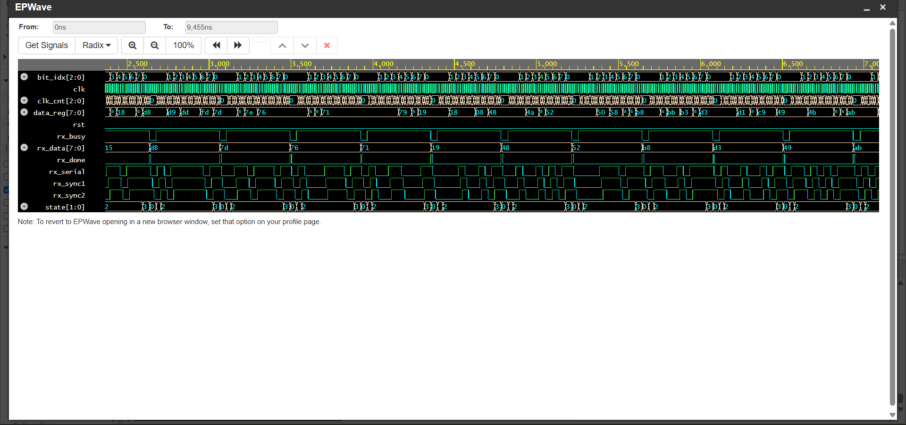
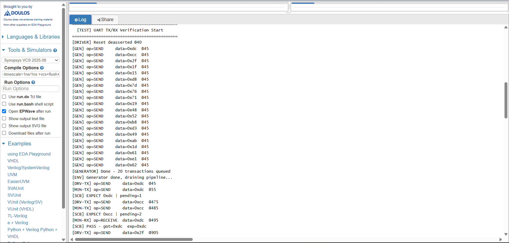
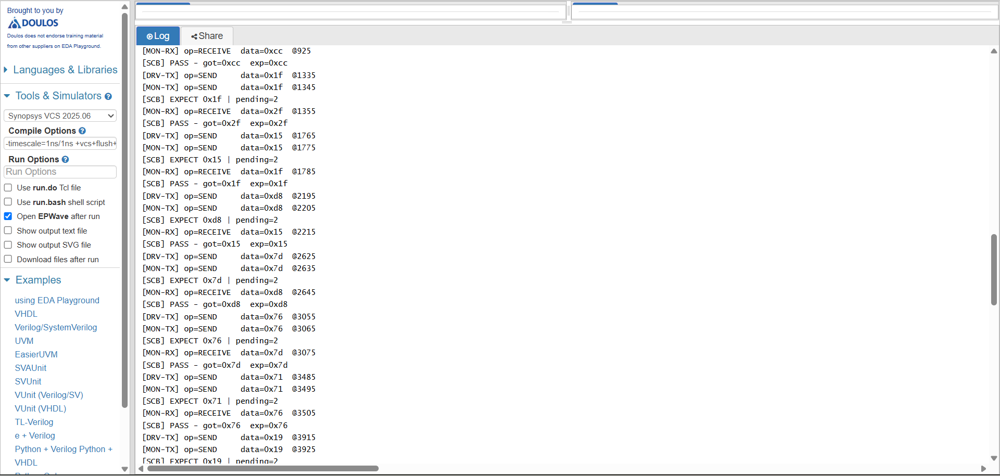
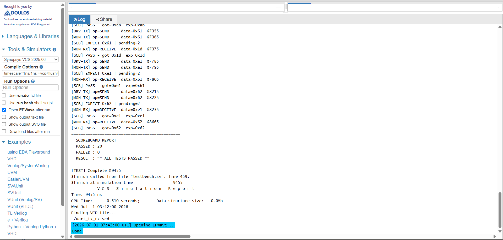

# UART-TX-RX-SystemVerilog
Designed and verified a Universal Asynchronous Receiver Transmitter (UART) using Verilog/SystemVerilog. The project includes UART Transmitter (TX), Receiver (RX), and a self-checking verification environment with testbench, assertions, functional coverage, and simulation waveforms to validate serial communication functionality.
# Synchronous FIFO Design and Verification
## Waveform

## Simulation Output 1

## Simulation Output 2

## Simulation Output 3

